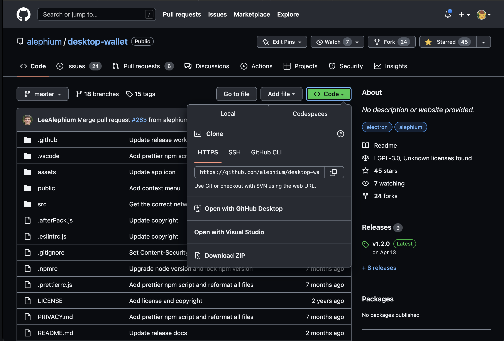
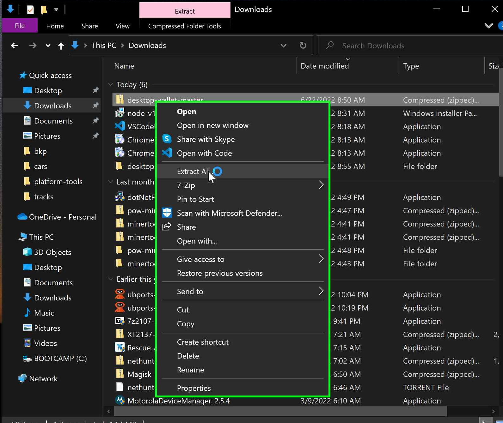

# How-To: Build Alephium `desktop-wallet` in Windows (10)

This document is written with the intention of demonstrating the build process in Windows.

**Note**: This guide was written for Windows 10, however the process should be the same for Windows 11. Please make an issue if you come across a Windows 11 specific issue and it will be addressed.

## Getting Started / Prerequisites

### Install NodeJS

Navigate to the [NodeJS Offical Installer](https://nodejs.org/en/download/) and download the Windows installer proper for your architecture (the most common choice is `x64` in `.msi` format)

After the download completes, open the installer and complete the wizard (all defaults are fine)


## Building


### Clone the Project

Download the `desktop-wallet` [repo](https://github.com/alephium/desktop-wallet).

This can be accomplished by selecting the green `<>Code` button and then `Download ZIP` from the dropdown.



Or by following this [link](https://github.com/alephium/desktop-wallet/archive/refs/heads/master.zip).

The project will now need to be extracted. Do this by right clicking on the `.zip` file and then `Extract All`



### Navigate to the Project Within a Terminal

Open a new terminal within the local repo with the following steps:

1. Open `File Explorer`

2. Navigate to, and open, the repo folder.

3. In the navigation bar (where the file path is currently located) type the following:

```
cmd
```

4. A terminal window should appear

### Build `desktop-wallet`

Install the required dependencies by entering the following command into the terminal window opened in the previous step:

```
npm install
```

The command below will detect your OS and build the corresponding package, enter it into the same terminal window:

```
npm run electron-pack
```

This will create an executable file located in the `./dist` directory.

Move this file to the location of your choice, most people choose the desktop.
